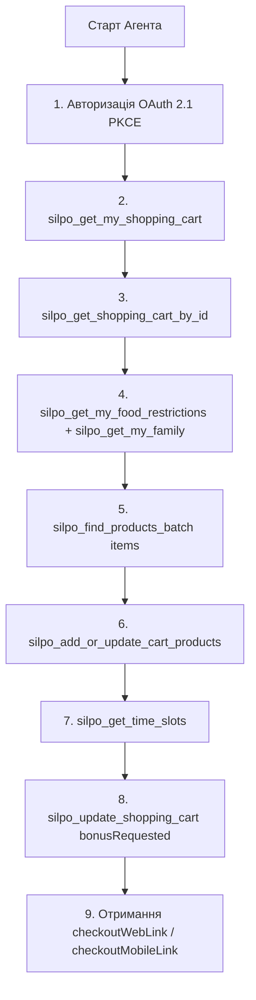

# 🔌 Документація та Можливості MCP «Сільпо» (`https://mcp.silpo.ua/mcp`)

## 1. Технічний протокол та підключення

* **MCP Endpoint:** `https://mcp.silpo.ua/mcp`
* **Транспорт:** Streamable HTTP (стандарт MCP over HTTP)
* **Авторизація:** OAuth 2.1 (Authorization Code + PKCE)
* **Dynamic Registration:** `POST https://mcp.silpo.ua/register`
* **Authorize URL:** `https://mcp.silpo.ua/authorize`
* **Token URL:** `https://mcp.silpo.ua/token`
* **Bearer Token Header:** `Authorization: Bearer <mcp_token>`

---

## 2. Повний список з 39 MCP Інструментів (Tools)

### 📍 Категорія 1: Локація та Доставка (6 tools)
1. `silpo_find_address`
   * **Опис:** Пошук географічних координат (lat/lng) за текстовою адресою.
   * **Навіщо:** Перший крок при зміні адреси доставки.
2. `silpo_get_available_delivery_types`
   * **Опис:** Перевірка доступних способів доставки за координатами (lat/lng).
   * **Варіанти:** `DeliveryHome`, `WideAssortDelivery`, `SelfPickup`, `NovaPoshta`, `B2B`.
3. `silpo_list_branches`
   * **Опис:** Список фізичних магазинів «Сільпо» з фільтрацією (`hasPickup`, `hasNovaPoshta`).
4. `silpo_get_time_slots`
   * **Опис:** Доступні часові слоти доставки для обраного магазину.
   * **Умова:** Обов'язково викликати для валідації слота після отримання кошика.
5. `silpo_find_nova_poshta_settlements`
   * **Опис:** Пошук населених пунктів для доставки через Нову Пошту.
6. `silpo_find_nova_poshta_offices`
   * **Опис:** Пошук відділень та поштоматів Нової Пошти у населеному пункті.

---

### 🔍 Категорія 2: Пошук Товарів та Аналогів (7 tools)
7. `silpo_find_products_batch` 🔒 *cart*
   * **Опис:** Паралельний пошук до 30 товарів за 1 виклик.
   * **Навіщо:** Основний інструмент для перетворення списку покупок/рецепта у товари.
8. `silpo_get_products` 🔒 *cart*
   * **Опис:** Пошук товарів за фільтрами (категорія, акція, текстовий запит, пагінація).
9. `silpo_get_product_details` 🔒 *cart*
   * **Опис:** Повна картка товару: склад, калорійність/БЖУ, атрибути, зображення.
10. `silpo_get_similar_products` 🔒 *cart*
    * **Опис:** Пошук схожих товарів за slug.
11. `silpo_get_replacements` 🔒 *cart*
    * **Опис:** Автоматичний підбір замін для товарів, яких немає в наявності у магазині.
12. `silpo_get_my_favorites`
    * **Опис:** Отримання списку «улюблених» товарів гостя.
13. `silpo_add_or_update_favorite_products` ✎ *write*
    * **Опис:** Додавання або видалення товарів зі списку улюблених.

---

### 📚 Категорія 3: Каталог та Акції (6 tools)
14. `silpo_get_promotions` 🔒 *cart*
    * **Опис:** Отримання активних акцій та спеціальних цін у конкретному магазині.
15. `silpo_get_popular_categories` 🔒 *cart*
    * **Опис:** Популярні категорії товарів для даної філії.
16. `silpo_get_category` 🔒 *cart*
    * **Опис:** Деталі конкретної категорії (підкатегорії, кількість товарів).
17. `silpo_get_categories`
    * **Опис:** Плоский список усіх доступних категорій.
18. `silpo_get_categories_tree` 🔒 *cart*
    * **Опис:** Повне ієрархічне дерево категорій.
19. `silpo_get_product_sets`
    * **Опис:** Кураторські добірки товарів від «Сільпо» (сезонні, тематичні, до свят).

---

### 🛒 Категорія 4: Кошик та Оформлення (7 tools)
20. `silpo_get_my_shopping_cart`
    * **Опис:** Отримання ID активного кошика гостя (завжди 1-й крок сесії).
21. `silpo_get_shopping_cart_by_id`
    * **Опис:** Повний вміст кошика: товари, доставка, тайм-слот, підсумкова сума, валідації, бонуси, посилання `checkoutWebLink` та `checkoutMobileLink`.
22. `silpo_add_or_update_cart_products` ✎ *write*
    * **Опис:** Додавання товарів або зміна їх кількості (`productId` + `companyId` + `branchId`).
23. `silpo_remove_cart_products` ✎ *write*
    * **Опис:** Видалення конкретних позицій з кошика.
24. `silpo_clear_shopping_cart` ✎ *write*
    * **Опис:** Повне очищення кошика.
25. `silpo_update_shopping_cart` ✎ *write*
    * **Опис:** Оновлення параметрів кошика: адреса, слот, промокод, спосіб оплати, списання балабонусів.
26. `silpo_add_or_update_certificates` ✎ *write*
    * **Опис:** Застосування або зняття подарункових сертифікатів.

---

### 🧾 Категорія 5: Замовлення та Історія (2 tools)
27. `silpo_get_my_online_orders`
    * **Опис:** Історія онлайн-замовлень через сайт чи застосунок. Дозволяє повторити замовлення в 1 клік.
28. `silpo_get_my_offline_orders`
    * **Опис:** Історія покупок у фізичних супермаркетах: чеки, товари, знижки, зароблені бонуси.

---

### 👤 Категорія 6: Персональний Профіль (4 tools)
29. `silpo_get_my_profile`
    * **Опис:** Особисті дані гостя: ім'я, телефон, email, дата народження.
30. `silpo_get_my_delivery_addresses`
    * **Опис:** Список збережених адрес доставки.
31. `silpo_get_my_family`
    * **Опис:** Дані про сім'ю в профілі: діти (із зазначенням віку) та домашні тварини.
32. `silpo_get_my_food_restrictions`
    * **Опис:** Дієтичні обмеження та харчові уподобання гостя.

---

### 🎁 Категорія 7: Лояльність, Бонуси та Сертифікати (7 tools)
33. `silpo_get_loyalty_info`
    * **Опис:** Статус картки «Власний Рахунок», поточний та нарахований баланс балабонусів.
34. `silpo_get_my_coupons`
    * **Опис:** Доступні персональні купони на знижку.
35. `silpo_get_coupon_details`
    * **Опис:** Детальні умови купона: товари, обмеження, штрих-код.
36. `silpo_get_my_promos`
    * **Опис:** Персональні промо-пропозиції.
37. `silpo_get_promo_codes`
    * **Опис:** Активні промокоди гостя.
38. `silpo_get_my_certificates`
    * **Опис:** Подарункові сертифікати (код, номінал, штрих-код).
39. `silpo_get_my_premium_subscription`
    * **Опис:** Статус підписки Silpo Premium.

---

## 3. Типовий алгоритм взаємодії AI-Агента (Flow)

